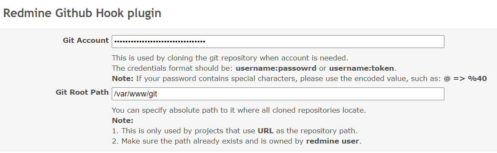
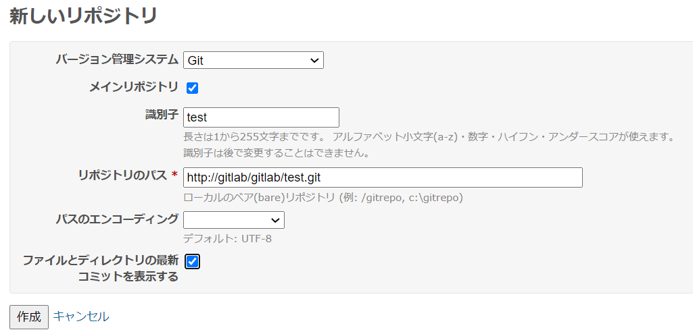

# Redmine GitHub Hook

This plugin is based on [redmine_github_hook](https://github.com/koppen/redmine_github_hook).

I added the Settings page to enable redmine git scm url to be set by repository's URL.

## HowTo
Please read [HowTo.md](./README_howto.md)

## SS

